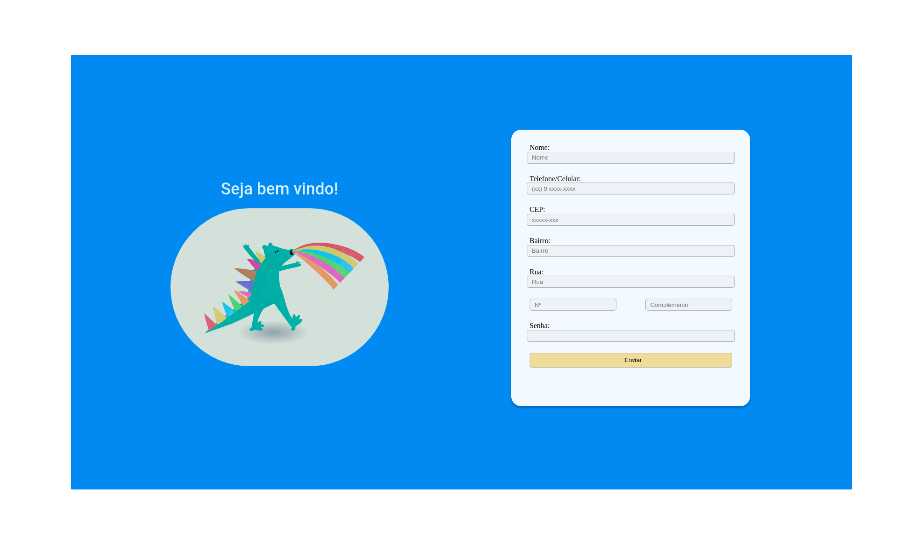

<h1 align="center">Formulaŕio</h1>

<p align="center">
 <a href="#objetivo">Objetivo</a> •
 <a href="#Pré-requisitos">Pré-requisitos</a> • 
  <a href="#Rodar a aplicação">Rodar a aplicação</a> • 
 <a href="#tecnologias">Tecnologias</a> • 
</p>

<h1 align="center">
  
</h1>

### Objetivo
Criar um formulário de cadastro simples utilizando criptografia, API de auto-preenchimento,
banco de dados e servidor em node.

### Pré-requisitos

Antes de começar, você vai precisar ter instalado em sua máquina as seguintes ferramentas:
 [Node.js](https://nodejs.org/en/).

### Rodar a aplicação

```bash

# Clone este repositório
$ git clone https://github.com/tiagoharumitsukodama/formulario.git

# Acesse a pasta do projeto no terminal/cmd
$ cd formulario

# Instale as dependências
$ npm install

# Execute a aplicação
$ npm run start

# O servidor inciará na porta:3000 - acesse http://localhost:3000 

```


### Tecnologias

As seguintes ferramentas foram usadas na construção do projeto:

- [Bootstrap](https://getbootstrap.com/)
- [Node.js](https://nodejs.org/en/)
- [Mongodb](https://www.mongodb.com/)
- [Ejs](https://ejs.co/)

### Estrutura

``` bash
├── package.json
├── package-lock.json
├── README.md
├── server.js
└── src
    ├── controllers
    │   ├── index.js
    │   ├── informacoes.js
    │   └── login.js
    ├── models
    │   ├── cadastrar.js
    │   ├── pegarDados.js
    │   ├── schema.js
    │   └── verificacao.js
    ├── public
    │   ├── images
    │   │   ├── Banner.png
    │   │   └── dinossauro.png
    │   ├── script
    │   │   └── index.js
    │   └── style
    │       ├── conteiners
    │       │   ├── container_login.css
    │       │   ├── container_tabela.css
    │       │   ├── conteiner_apresentacao.css
    │       │   └── conteiner_formulario.css
    │       └── index.css
    ├── routes
    │   ├── index.js
    │   ├── informacoes.js
    │   └── login.js
    └── views
        ├── index.ejs
        ├── informacoes
        │   └── index.ejs
        └── login
            └── index.ejs
```